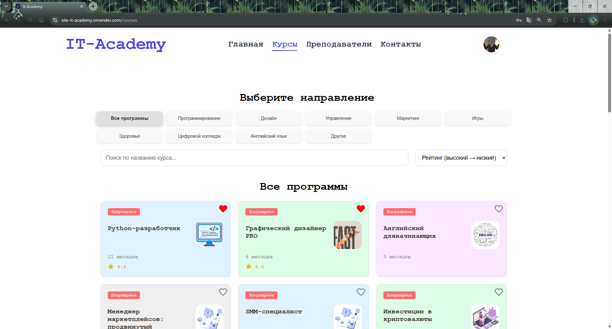

# 🎓 IT Academy — MERN-платформа для офлайн-обучения

Полноценный сайт образовательной платформы, разработанный на MERN-стеке: **React + Vite** на frontend и **Node.js + Express + MongoDB** на backend.

## 🚀 Возможности

- 🔐 Регистрация и авторизация пользователей
- 📚 Каталог онлайн-курсов
- 📝 Оформление заявок на обучение
- 📂 Backend API с хранением данных в MongoDB
- 📱 Адаптивная верстка под любые устройства

## 🧰 Технологии

### 🔷 Frontend
- React + Vite
- React Router DOM
- Yarn

### 🔶 Backend
- Express.js
- MongoDB + Mongoose
- Node.js
- Yarn

## 📦 Установка и запуск

### Клонирование репозитория
```bash
git clone https://github.com/UsmanGamidov/Site-It-Academy.git
cd Site-It-Academy
yarn install
```

### Запуск фронтенда
```bash
yarn dev
```

### Запуск бэкенда
```bash
yarn dev_server
```

> Не забудь настроить `.env` файлы с переменными окружения (например, `MONGO_URI`, `PORT`, и пр.)

## 🌐 API (Примеры)
- `POST /api/register` — регистрация
- `POST /api/login` — авторизация
- `GET /api/courses` — получить список курсов
- `POST /api/apply` — подача заявки

```markdown
## 📸 Скриншоты
PS: это не все скрины

### 🔐 Регистрация


### 🏠 Главная


### 📚 Курсы


### 📘 Страница курса


### ⭐ Отзывы


## 📬 Автор

- 💼 [Usman Gamidov](https://github.com/UsmanGamidov)
- 📩 Telegram: [@At_taqwa_tw](https://t.me/At_taqwa_tw)

---

🧠 Проект создан для практики и демонстрации навыков fullstack-разработки.
